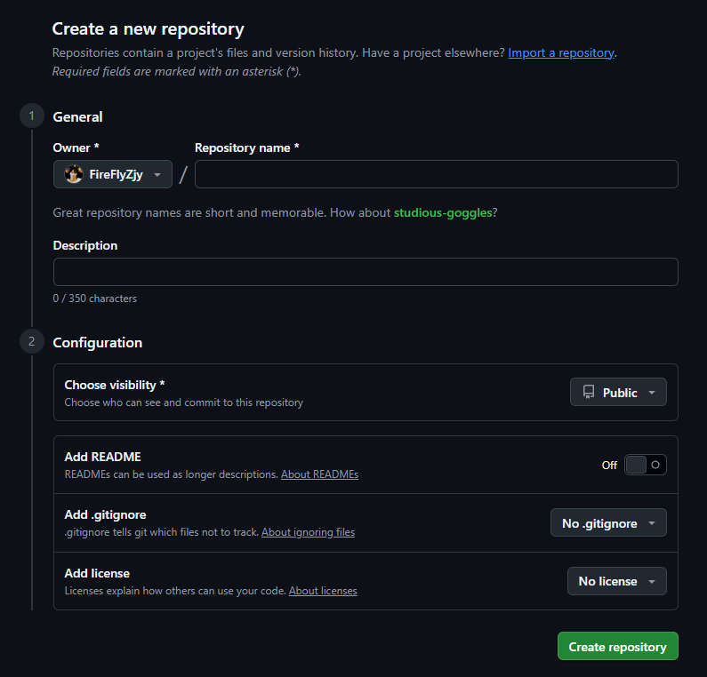
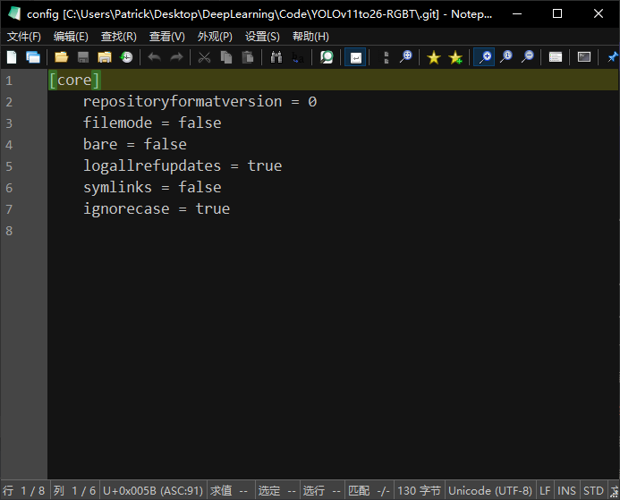
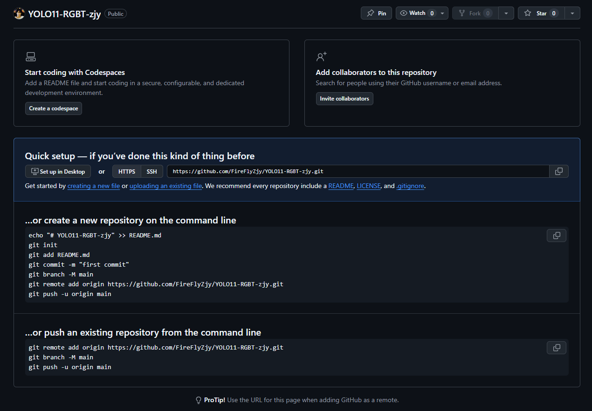
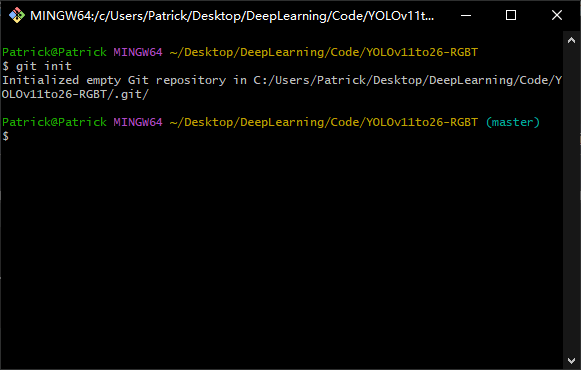
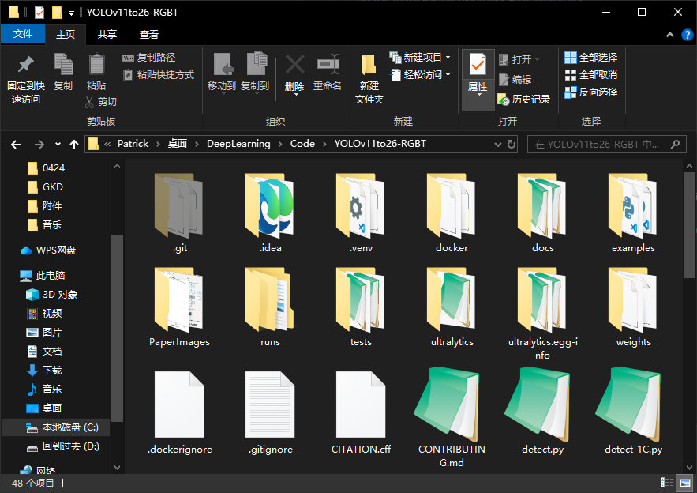
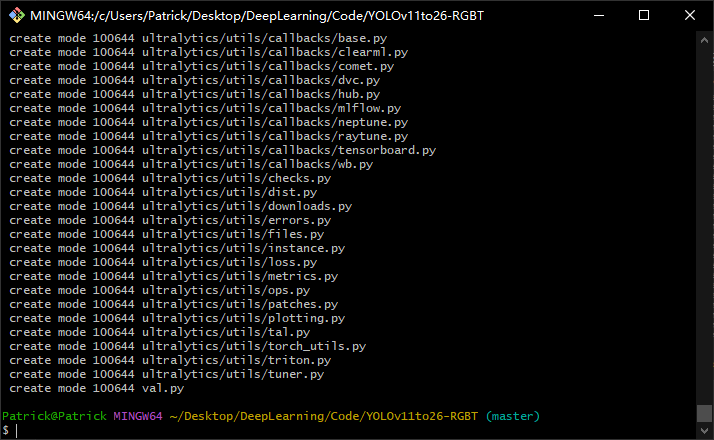
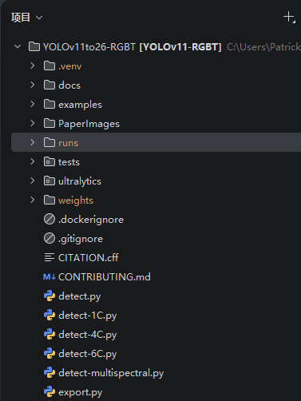

<!-- START doctoc generated TOC please keep comment here to allow auto update -->
<!-- DON'T EDIT THIS SECTION, INSTEAD RE-RUN doctoc TO UPDATE -->
**Table of Contents**  *generated with [DocToc](https://github.com/thlorenz/doctoc)*

- [使用`Git Bash`将本地仓库推送到`GitHub`](#%E4%BD%BF%E7%94%A8git-bash%E5%B0%86%E6%9C%AC%E5%9C%B0%E4%BB%93%E5%BA%93%E6%8E%A8%E9%80%81%E5%88%B0github)
    - [第一步：在`GitHub`上新建项目](#%E7%AC%AC%E4%B8%80%E6%AD%A5%E5%9C%A8github%E4%B8%8A%E6%96%B0%E5%BB%BA%E9%A1%B9%E7%9B%AE)
    - [第二步：配置邮箱+用户名](#%E7%AC%AC%E4%BA%8C%E6%AD%A5%E9%85%8D%E7%BD%AE%E9%82%AE%E7%AE%B1%E7%94%A8%E6%88%B7%E5%90%8D)
      - [方式 1：命令行](#%E6%96%B9%E5%BC%8F-1%E5%91%BD%E4%BB%A4%E8%A1%8C)
      - [方式 2：修改config文件](#%E6%96%B9%E5%BC%8F-2%E4%BF%AE%E6%94%B9config%E6%96%87%E4%BB%B6)
    - [第三步：`Push`本地代码到`GitHub`](#%E7%AC%AC%E4%B8%89%E6%AD%A5push%E6%9C%AC%E5%9C%B0%E4%BB%A3%E7%A0%81%E5%88%B0github)
      - [Tips](#tips)
      - [第一块：适合从零开始](#%E7%AC%AC%E4%B8%80%E5%9D%97%E9%80%82%E5%90%88%E4%BB%8E%E9%9B%B6%E5%BC%80%E5%A7%8B)
      - [第二块：适合上传本地已有项目](#%E7%AC%AC%E4%BA%8C%E5%9D%97%E9%80%82%E5%90%88%E4%B8%8A%E4%BC%A0%E6%9C%AC%E5%9C%B0%E5%B7%B2%E6%9C%89%E9%A1%B9%E7%9B%AE)
      - [下面详细展开讲一下涉及到的两个场景](#%E4%B8%8B%E9%9D%A2%E8%AF%A6%E7%BB%86%E5%B1%95%E5%BC%80%E8%AE%B2%E4%B8%80%E4%B8%8B%E6%B6%89%E5%8F%8A%E5%88%B0%E7%9A%84%E4%B8%A4%E4%B8%AA%E5%9C%BA%E6%99%AF)
        - [场景1 ：本地已有代码文件夹，推送到 `GitHub` 空仓库](#%E5%9C%BA%E6%99%AF1-%E6%9C%AC%E5%9C%B0%E5%B7%B2%E6%9C%89%E4%BB%A3%E7%A0%81%E6%96%87%E4%BB%B6%E5%A4%B9%E6%8E%A8%E9%80%81%E5%88%B0-github-%E7%A9%BA%E4%BB%93%E5%BA%93)
        - [场景2 ：本地无代码，从零新建项目推送到 `GitHub`](#%E5%9C%BA%E6%99%AF2-%E6%9C%AC%E5%9C%B0%E6%97%A0%E4%BB%A3%E7%A0%81%E4%BB%8E%E9%9B%B6%E6%96%B0%E5%BB%BA%E9%A1%B9%E7%9B%AE%E6%8E%A8%E9%80%81%E5%88%B0-github)
    - [将代码`push`到`GitHub`以后本地项目文件夹中项目文件的变化](#%E5%B0%86%E4%BB%A3%E7%A0%81push%E5%88%B0github%E4%BB%A5%E5%90%8E%E6%9C%AC%E5%9C%B0%E9%A1%B9%E7%9B%AE%E6%96%87%E4%BB%B6%E5%A4%B9%E4%B8%AD%E9%A1%B9%E7%9B%AE%E6%96%87%E4%BB%B6%E7%9A%84%E5%8F%98%E5%8C%96)

<!-- END doctoc generated TOC please keep comment here to allow auto update -->

## 使用`Git Bash`将本地仓库推送到`GitHub`

#### 第一步：在`GitHub`上新建项目

1. 登录 `GitHub` 官网：[https://github.com](https://github.com)

2. 右上角点击 **+** 号 → **New repository**

3. 填写配置：

- `Repository name`：填你的仓库名（英文无空格）
- `Description`：可选填项目描述
- 选 `Public`（公开仓库）
- ❌ **不勾选** `Add a README file`
- ❌ **不勾选** `Add .gitignore`
- ❌ **不勾选** `Choose a license`

4. 点击最下方 `Create repository`

5. 进入仓库页面，复制 **`HTTPS` 地址**（备用）



#### 第二步：配置邮箱+用户名

##### 方式 1：命令行

首先在`Git Bash`中执行这条命令查看是否配置过邮箱+用户名

```
git config --global --list
```

如果之前没配置过，或者要提交到其他账户的`GitHub`仓库，依次在`Git Bash`中执行下面的命令

```
git config --global user.email "yourmail@XXX.com"
git config --global user.name "yourname"
```

##### 方式 2：修改config文件

打开`.git`目录下的`config`文件



在文件末尾加上下面的命令并保存。

```
[user]
	name = yourname
	email = yourmail@XXX.com
```

#### 第三步：`Push`本地代码到`GitHub`

##### Tips

**注意**：其实在创建完`GitHub`项目以后，这里就会给出你相应的提示。



这里主要对下面两块区域作解释：
##### 第一块：适合从零开始

```
...or create a new repository on the command line
```

**本地还没有项目，想从零开始创建仓库**的场景，命令解释：

```
# 0. 创建 README.md 文件（可省略） 
echo "# YOLO11-RGBT-zjy" >> README.md 

# 1. 初始化本地 Git 仓库 
git init 

# 2. 把文件添加到暂存区 
git add README.md 

# 3. 提交第一次代码（备注是 first commit） 
git commit -m "first commit" 

# 4. 把默认分支重命名为 main（GitHub 默认主分支名） 
git branch -M main 

# 5. 把本地仓库和远程 GitHub 仓库关联（就是上面的地址） 
git remote add origin https://github.com/FireFlyZjy/YOLO11-RGBT-zjy.git 

# 6. 把本地 main 分支推送到远程仓库 
git push -u origin main

# 后续再次推送只需执行 git push 即可
```

##### 第二块：适合上传本地已有项目

```
...or push an existing repository from the command line
```

**本地已经有 Git 仓库，想推送到这个新建的 GitHub 仓库**的场景，命令解释：

```
# 1. 把本地仓库和远程 GitHub 仓库关联 
git remote add origin https://github.com/FireFlyZjy/YOLO11-RGBT-zjy.git 

# 2. 确保本地分支是 main 
git branch -M main 

# 3. 把本地分支推送到远程仓库 
git push -u origin main
```

如果GitHub仓库不是空仓库，需要先合并GitHub和本地仓库再push

```
# 拉取远程代码，允许合并不相关的历史 
git pull origin main --allow-unrelated-histories -m "合并远程仓库初始化内容"

# 合并完成后，再推送到远程 
git push -u origin main
```

##### 下面详细展开讲一下涉及到的两个场景
###### 场景1 ：本地已有代码文件夹，推送到 `GitHub` 空仓库

**步骤 1**：初始化本地仓库

进入到要Push的本地目录，在你的代码根目录空白处 → 右键 **Git Bash Here**

输入`git init`命令进行初始化仓库



初始化完成后会在本地目录生成一个`.git`文件夹



**步骤 2**：检查主分支是否为`main`

输入这条命来检验主分支到底是`main`还是`master`

` git branch --show-current`

因为前面已经配置过，所以这里一定会输出`main`

如果不是`main`，执行命令强制设置为`main`

```
git branch -M main
```

修改完后验证

```
git branch --show-current
```

如果输出`main`则表示修改成功。

**步骤 3**：把所有文件加入暂存区

```
git add .
```

**步骤 4**：本地第一次提交

运行

```
git commit -m "初始提交：上传完整项目代码"
```

`-m`后面是这次提交代码的说明，可以是中文，也可以是英文。

执行完这条命令后输出下面这种类似的内容就代表成功了。

<div align="center">
  
</div>

**步骤 5**：关联远程 `GitHub` 仓库

运行下面的命令，把后面地址换成你刚才复制的 `GitHub HTTPS` 地址：

```
git remote add origin [你的GitHub仓库HTTPS地址]
```

==验证关联是否成功==，运行

```
git remote -v
```

能看到`origin`（远程仓库的名字默认叫`origin`，不用改）后面跟着你的`GitHub`仓库`HTTPS`地址，就是绑定成功。

如果没有任何输出，就执行下面的命令进行关联

```
git remote add origin [GitHub地址]
```

==使用`HTTPS`地址关联可能会出现网络问题，因此这里推荐使用SSH进行关联==

1. 先在 GitHub 上配置 SSH 密钥（如果还没配置），参考[GitHub 官方教程](https://docs.github.com/cn/authentication/connecting-to-github-with-ssh)。

2. 把远程仓库地址换成 SSH 格式：

```
# 先删除原来的HTTPS远程地址 
git remote remove origin 

# 添加SSH地址（替换成你的仓库SSH地址，一般是 git@github.com:FireFlyZjy/YOLO11-RGBT-zjy.git） 
git remote add origin git@github.com:FireFlyZjy/YOLO11-RGBT-zjy.git
```

测试连接：

```
ssh -T git@github.com
```

成功会显示 `Hi [你的GitHub用户名]! You've successfully authenticated...`。

**步骤 6**：第一次推送到远程并绑定分支

运行

```
git push -u origin main
```

###### 场景2 ：本地无代码，从零新建项目推送到 `GitHub`

1. 电脑新建空文件夹，进入文件夹打开 `Git Bash`

2. 依次执行：

```
# 初始化本地仓库
git init 

# 修改主分支为main
git branch -M main 

# 添加本地仓库的文件到暂存区
git add . 

# 提交项目并写说明
git commit -m "初始提交" 

# 连接远程仓库地址（推荐使用SSH）
git remote add origin [仓库HTTPS/SSH地址] 

# 可以在执行推送命令前检查一下是否是要推送的库
git remote -v

# 将本地仓库的文件push到GitHub
git push -u origin main
```

==最后，验证是否推送成功==

a. 终端输出没有报错，最后显示类似：  

```
$ git push -u origin main
Enumerating objects: 1186, done.
Counting objects: 100% (1186/1186), done.
Delta compression using up to 12 threads
Compressing objects: 100% (814/814), done.
Writing objects: 100% (1186/1186), 7.29 MiB | 344.00 KiB/s, done.
Total 1186 (delta 358), reused 1186 (delta 358), pack-reused 0 (from 0)
remote: Resolving deltas: 100% (358/358), done.
To github.com:FireFlyZjy/YOLO11-RGBT-zjy.git
 * [new branch]      main -> main
branch 'main' set up to track 'origin/main'.
```

b. 打开你的` GitHub `仓库页面 `https://github.com/FireFlyZjy/YOLO11-RGBT-zjy`，就能看到你上传的所有代码文件了。

#### 将代码`push`到`GitHub`以后本地项目文件夹中项目文件的变化



可以看到上传项目到`GitHub`上以后，有的目录/文件颜色发生了改变

**【黄色 / 橙色的文件夹】：未被 `Git` 跟踪的文件（`Untracked`）**

- `runs`文件夹（包括里面的训练日志、模型子文件夹）显示橙色 / 黄色，说明：
    
    - 它们**没有被`.gitignore`忽略**
    - 也没有被你执行过`git add`命令，Git 还没把它们加入版本控制
    
- 这意味着：
    
    这些文件在你的电脑上存在，但 `Git` 不会自动把它们提交到 `GitHub`，除非你手动执行`git add runs/`把它们加入暂存区。

⚠️注意：

**训练日志、模型权重**这类大文件（通常几 GB），**不适合提交到 GitHub**，可以将对应目录/文件加入`.gitignore`，让它被忽略。

打开项目根目录的`.gitignore`文件（如果没有，新建一个同名文件）
加入一行配置：`runs/`


补充：`VS Code/PyCharm` 等`IDE`中其他 `Git` 状态颜色含义（以后遇到能快速识别）


