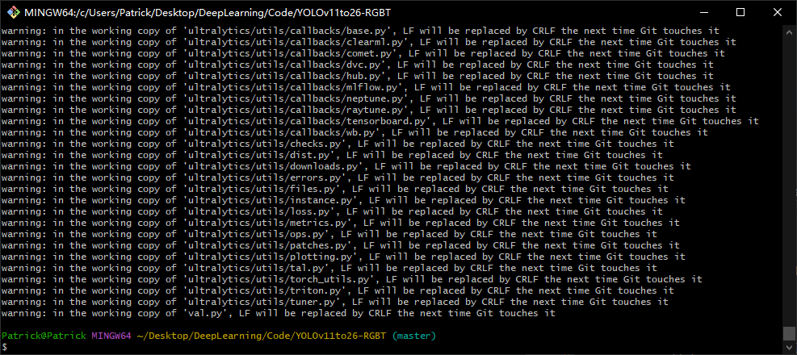

<!-- START doctoc generated TOC please keep comment here to allow auto update -->
<!-- DON'T EDIT THIS SECTION, INSTEAD RE-RUN doctoc TO UPDATE -->
## 目录

- [常见报错 `&` 警告解决方案](#%E5%B8%B8%E8%A7%81%E6%8A%A5%E9%94%99--%E8%AD%A6%E5%91%8A%E8%A7%A3%E5%86%B3%E6%96%B9%E6%A1%88)

<!-- END doctoc generated TOC please keep comment here to allow auto update -->

## 常见报错 `&` 警告解决方案

**1. 出现` LF will be replaced by CRLF `警告**

执行`git add .`命令时可能会报出这样的警告。



**这个警告到底在说什么？**

- `LF`（`\n`）：`Linux/macOS` 系统的标准换行符
- `CRLF`（`\r\n`）：`Windows` 系统的标准换行符
- 你的项目文件里用的是 `LF`，但你现在在 Windows 系统操作，Git 会自动把 `LF` 转换成 Windows 兼容的 `CRLF`，所以弹出这个提示。

**核心结论**：这个转换是 Git 的跨平台兼容功能，是正常的，不用紧张。

**解决方法**：

保留自动转换，关闭警告。直接关闭提示，但 Git 依然会帮你处理换行符兼容，不影响仓库里的文件格式。
```
git config --global core.safecrlf false
```


**2. 报错 `remote origin already exists`**

已经关联过远程仓库，先删除旧的再重新关联：

```
git remote remove origin 
git remote add origin 新仓库地址
```

**3. 推送提示分支不匹配**

执行分支重命名再推送：

```
git branch -M main
git push -u origin main
```

**4. GitHub 连接超时、Connection was reset**

可后续改用 `SSH` 协议，或换网络；日常学习也可改用 `Gitee/GitCode`，**所有 Git 命令完全通用**。

如果提示

`error: failed to push some refs to 'https://github.com/FireFlyZjy/YOLO11-RGBT-zjy.git'

说明网络连接不稳定

执行命令检查你现在的 `origin` 还是 `HTTPS` 格式，还是 `SSH` 地址

```
git remote -v
```

如果输出如下，则表示当前使用的是 `HTTPS` 方式连接，会遇到网络问题。需要修改为 `SSH` 地址。

```
origin  https://github.com/FireFlyZjy/YOLO11-RGBT-zjy.git (fetch)
origin  https://github.com/FireFlyZjy/YOLO11-RGBT-zjy.git (push)
```

修改命令为

```
git remote set-url origin git@github.com:FireFlyZjy/YOLO11-RGBT-zjy.git
```

如果没有任何输出，代表修改完成。执行`git remote -v`验证，输出下面的命令代表修改成功。

```
origin  git@github.com:FireFlyZjy/YOLO11-RGBT-zjy.git (fetch)
origin  git@github.com:FireFlyZjy/YOLO11-RGBT-zjy.git (push)
```
